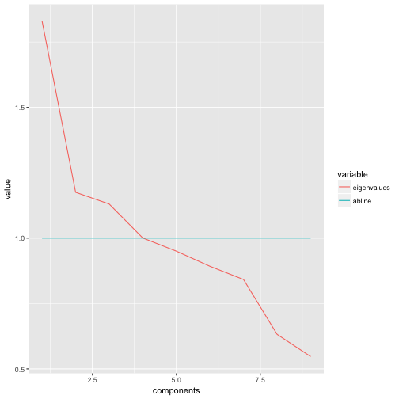

###Human Resources Analytics
##Why are our best and most experienced employees leaving prematurely?
 Fields in the dataset include:

Employee satisfaction level
Last evaluation
Number of projects
Average monthly hours
Time spent at the company
Whether they have had a work accident
Whether they have had a promotion in the last 5 years
Department
Salary
Whether the employee has left


```r
myData <- read.csv(file = "DATA/HR_comma_sep.csv", header = TRUE, sep=",")
# This are the project data with an added column of ID

View(myData, header=FALSE)
```

```
## Error in View(myData, header = FALSE): unused argument (header = FALSE)
```

```r
colnames(myData)
```

```
##  [1] "satisfaction_level"    "last_evaluation"      
##  [3] "number_project"        "average_montly_hours" 
##  [5] "time_spend_company"    "Work_accident"        
##  [7] "left"                  "promotion_last_5years"
##  [9] "sales"                 "salary"
```


####Questions

What are the main factor influencing employers satisfaction
Which of those factor influence the employeers leaving


## Step 1: Confirm data is metric


```
## Error in is.data.frame(frame): oggetto "MyDataID" non trovato
```

```
## Error in is.data.frame(x): oggetto "ProjectData" non trovato
```

```
## Error in ncol(ProjectData): oggetto "ProjectData" non trovato
```

```
## Error in eval(expr, envir, enclos): oggetto "ProjectData" non trovato
```

```
## Error in is.data.frame(frame): oggetto "ProjectDataFactor" non trovato
```

## Step 1: Confirm data is metric


```r
knitr::kable(round(my_summary(ProjectDataFactor), 2))
```

```
## Error in apply(thedata, 2, function(r) c(min(r), quantile(r, 0.25), quantile(r, : oggetto "ProjectDataFactor" non trovato
```
## Step 2: Scale the  data

```r
ProjectDatafactor_scaled = apply(ProjectDataFactor, 2, function(r) {
    if (sd(r) != 0) 
        res = (r - mean(r))/sd(r) else res = 0 * r
    res
})
```

```
## Error in apply(ProjectDataFactor, 2, function(r) {: oggetto "ProjectDataFactor" non trovato
```
Notice now the summary statistics of the scaled dataset:


```r
knitr::kable(round(my_summary(ProjectDatafactor_scaled), 2))
```

```
## Error in apply(thedata, 2, function(r) c(min(r), quantile(r, 0.25), quantile(r, : oggetto "ProjectDatafactor_scaled" non trovato
```

## Step 3:  Check correlations 
Check for correlation


```r
thecor = round(cor(ProjectDataFactor),2)
```

```
## Error in is.data.frame(x): oggetto "ProjectDataFactor" non trovato
```

```r
colnames(thecor)<-colnames(ProjectDataFactor)
```

```
## Error in is.data.frame(x): oggetto "ProjectDataFactor" non trovato
```

```r
rownames(thecor)<-colnames(ProjectDataFactor)
```

```
## Error in is.data.frame(x): oggetto "ProjectDataFactor" non trovato
```

```r
knitr::kable(round(thecor,2))
```

```
## Error in inherits(x, "list"): oggetto "thecor" non trovato
```

Apply the facto analysis, set with eingvalue


```r
UnRotated_Results<-principal(ProjectDataFactor, nfactors=ncol(ProjectDataFactor), rotate="none",score=TRUE)
```

```
## Error in principal(ProjectDataFactor, nfactors = ncol(ProjectDataFactor), : oggetto "ProjectDataFactor" non trovato
```

```r
UnRotated_Factors<-round(UnRotated_Results$loadings,2)
```

```
## Error in eval(expr, envir, enclos): oggetto "UnRotated_Results" non trovato
```

```r
UnRotated_Factors<-as.data.frame(unclass(UnRotated_Factors))
```

```
## Error in as.data.frame(unclass(UnRotated_Factors)): oggetto "UnRotated_Factors" non trovato
```

```r
colnames(UnRotated_Factors)<-paste("Component",1:ncol(UnRotated_Factors),sep=" ")
```

```
## Error in ncol(UnRotated_Factors): oggetto "UnRotated_Factors" non trovato
```


```r
Variance_Explained_Table_results<-PCA(ProjectDataFactor, graph=FALSE)
```

```
## Error in as.data.frame(X): oggetto "ProjectDataFactor" non trovato
```

```r
Variance_Explained_Table<-Variance_Explained_Table_results$eig
```

```
## Error in eval(expr, envir, enclos): oggetto "Variance_Explained_Table_results" non trovato
```

```r
Variance_Explained_Table_copy<-Variance_Explained_Table
```

```
## Error in eval(expr, envir, enclos): oggetto "Variance_Explained_Table" non trovato
```

```r
rownames(Variance_Explained_Table) <- paste("Component", 1:nrow(Variance_Explained_Table))
```

```
## Error in nrow(Variance_Explained_Table): oggetto "Variance_Explained_Table" non trovato
```

```r
colnames(Variance_Explained_Table) <- c("Eigenvalue", "Pct of explained variance", "Cumulative pct of explained variance")
```

```
## Error in colnames(Variance_Explained_Table) <- c("Eigenvalue", "Pct of explained variance", : oggetto "Variance_Explained_Table" non trovato
```

```r
knitr::kable(round(Variance_Explained_Table, 2))
```

```
## Error in inherits(x, "list"): oggetto "Variance_Explained_Table" non trovato
```


```r
eigenvalues  <- Variance_Explained_Table[, "Eigenvalue"]
```

```
## Error in eval(expr, envir, enclos): oggetto "Variance_Explained_Table" non trovato
```

```r
df           <- cbind(as.data.frame(eigenvalues), c(1:length(eigenvalues)), rep(1, length(eigenvalues)))
```

```
## Error in as.data.frame(eigenvalues): oggetto "eigenvalues" non trovato
```

```r
colnames(df) <- c("eigenvalues", "components", "abline")
```

```
## Error in `colnames<-`(`*tmp*`, value = c("eigenvalues", "components", : attempt to set 'colnames' on an object with less than two dimensions
```

```r
ggplot(melt(df, id="components"), aes(x=components, y=value, colour=variable)) + geom_line()
```

```
## Don't know how to automatically pick scale for object of type function. Defaulting to continuous.
```

```
## Error in eval(expr, envir, enclos): oggetto "components" non trovato
```




```r
Rotated_Results<-principal(ProjectDatafactor_scaled, nfactors=max(3), rotate=rotation_used,score=TRUE)
```

```
## Error in principal(ProjectDatafactor_scaled, nfactors = max(3), rotate = rotation_used, : oggetto "ProjectDatafactor_scaled" non trovato
```

```r
Rotated_Factors<-round(Rotated_Results$loadings,2)
```

```
## Error in eval(expr, envir, enclos): oggetto "Rotated_Results" non trovato
```

```r
Rotated_Factors<-as.data.frame(unclass(Rotated_Factors))
```

```
## Error in as.data.frame(unclass(Rotated_Factors)): oggetto "Rotated_Factors" non trovato
```

```r
colnames(Rotated_Factors)<-paste("Component",1:ncol(Rotated_Factors),sep=" ")
```

```
## Error in ncol(Rotated_Factors): oggetto "Rotated_Factors" non trovato
```

```r
sorted_rows <- sort(Rotated_Factors[,1], decreasing = TRUE, index.return = TRUE)$ix
```

```
## Error in sort(Rotated_Factors[, 1], decreasing = TRUE, index.return = TRUE): oggetto "Rotated_Factors" non trovato
```

```r
Rotated_Factors <- Rotated_Factors[sorted_rows,]
```

```
## Error in eval(expr, envir, enclos): oggetto "Rotated_Factors" non trovato
```

```r
knitr::kable(Rotated_Factors)
```

```
## Error in inherits(x, "list"): oggetto "Rotated_Factors" non trovato
```

Here is the result of 3 principal factoor chosen 


```
Error in eval(expr, envir, enclos): oggetto "Rotated_Factors" non trovato
```

```
Error in Rotated_Factors_thres[abs(Rotated_Factors_thres) < MIN_VALUE] <- NA: oggetto "Rotated_Factors_thres" non trovato
```

```
Error in is.data.frame(x): oggetto "Rotated_Factors" non trovato
```

```
Error in rownames(Rotated_Factors): oggetto "Rotated_Factors" non trovato
```

```
Error in inherits(x, "list"): oggetto "Rotated_Factors_thres" non trovato
```


